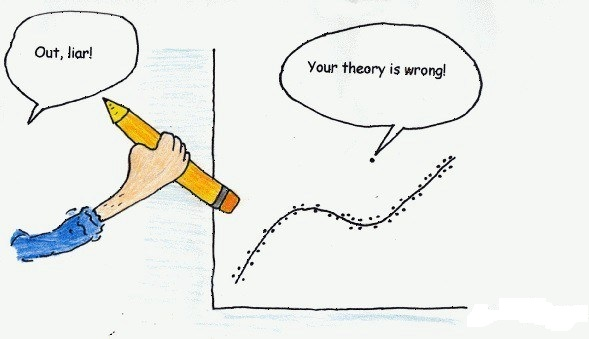

# python-outlier-detection

  

The performance of the machine learning algorithm also depends on properly detecting outliers in the dataset. Particularly the regression algorithms are very easily influenced by the outliers. In this case, if the dataset is not correctly cleaned by removing the outlier, then the model performance is unlikely to be as expected. PyOD - Python Toolkit for detecting Outliers. This package contains about 20 algorithms for detecting outliers.
